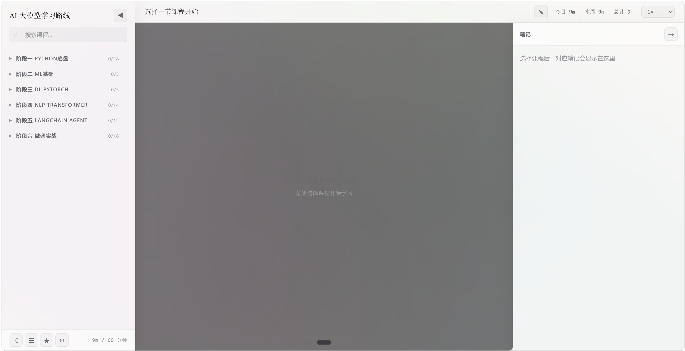
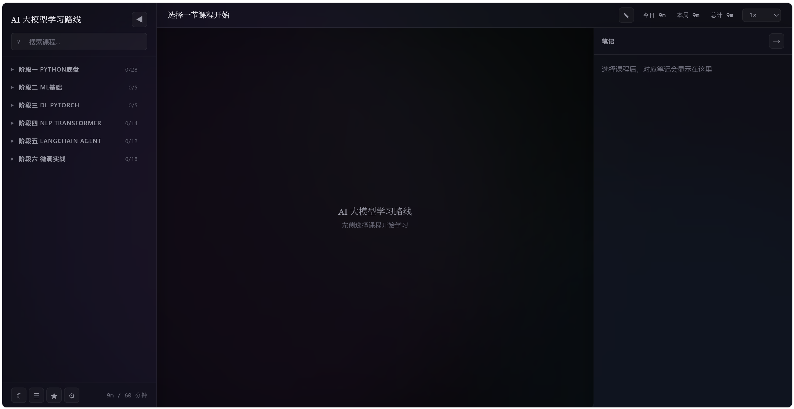
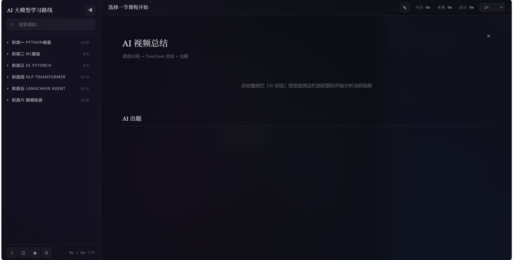
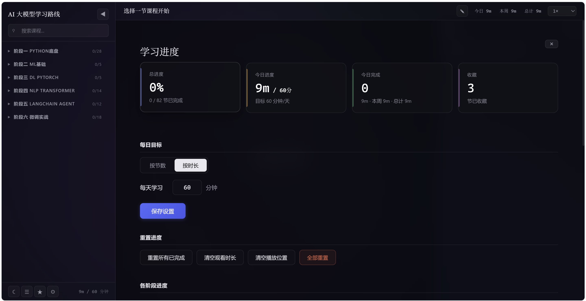

# AI Learning Platform

[](LICENSE)
[](https://www.python.org/downloads/)
[](https://github.com/Meaxtro-yxl/ai-learning-platform)

零依赖的本地 AI 视频学习平台。一个 HTML 文件搞定前端，一个 Python 文件搞定后端，开箱即用。

**核心功能**：课程树导航、播放列表自动续播、学习进度与目标追踪、AI 智能总结（DeepSeek）、暗色/亮色主题、数据仪表盘。

---

##  截图预览

<div align="center">
  
  ### 主界面（亮色主题）
  
  <p><em>课程树导航 + 视频播放器 + 学习进度追踪</em></p>
  
  ### 主界面（暗色主题）
  
  <p><em>一键切换暗色主题，保护视力</em></p>
  
  ### AI 智能总结
  
  <p><em>DeepSeek API 自动生成视频内容总结和练习题</em></p>
  
  ### 数据仪表盘
  
  <p><em>今日目标、阶段进度、收藏管理一目了然</em></p>
  
</div>

---

## ✨ 特性亮点

| 特性 | 说明 |
|------|------|
| 🚀 **零依赖部署** | 一个 HTML + 一个 Python 文件，双击启动即用 |
| 📚 **课程树导航** | 阶段 → 课时 → 播放列表，层级清晰 |
| ▶️ **自动续播** | 一个课时的多个视频自动串联播放 |
| 📊 **进度追踪** | 完成状态、观看历史、每日学习时长统计 |
|  **AI 智能总结** | DeepSeek API 自动生成内容摘要和练习题（可选） |
| 🌙 **暗色/亮色主题** | 一键切换，保护视力 |
| 📈 **数据仪表盘** | 今日目标、阶段进度、收藏管理一目了然 |
|  **完全离线可用** | 除 AI 功能外，所有核心功能无需网络 |

---

## 🚀 Quick Start

### 1. 克隆仓库

```bash
git clone https://github.com/Meaxtro-yxl/ai-learning-platform.git
cd ai-learning-platform/assets
```

### 2. 配置视频路径

打开 `server.py`，找到 `VIDEO_ROOTS` 字典，填入你的视频目录：

```python
VIDEO_ROOTS = {
    "my-course": r"C:\Users\你的用户名\Videos\我的课程",
}
```

### 3. 启动服务器

```bash
# 基础启动（无需 API Key）
python server.py

# 启用 AI 总结（需要 DeepSeek API Key）
# Windows:
set DEEPSEEK_API_KEY=sk-your-api-key
python server.py

# macOS/Linux:
DEEPSEEK_API_KEY=sk-your-api-key python server.py
```

浏览器自动打开 `http://localhost:8765`，即可开始使用。

### 4. 自定义课程

编辑 `course-data.json` 添加你自己的课程：

```json
[
  {
    "id": "stage_01",
    "name": "阶段一 基础入门",
    "lessons": [
      {
        "id": "lesson_01",
        "name": "第一课 环境搭建",
        "source": "基础教程",
        "video": ["/video/my-course/01_介绍.mp4"],
        "notes": "本节课的环境搭建步骤..."
      }
    ]
  }
]
```

---

## 📁 项目结构

```
ai-learning-platform/
├── assets/
│   ├── learn.html          # 前端单文件 SPA (~113KB)
│   ├── server.py           # Python HTTP 服务器 (~21KB)
│   ├── course-data.json    # 课程数据模板
│   ├── handoff.md          # 开发约定
│   └── 设计蓝图.md         # 架构设计文档
├── .github/
│   └── workflows/
│       └── test.yml        # CI/CD 自动化测试
├── SKILL.md                # QoderWork Skill 主文件
├── architecture.md         # 前端架构详解
├── server-guide.md         # 后端 API 指南
├── LICENSE                 # MIT License
└── README.md               # 本文档
```

---

## ️ 技术栈

- **前端**：原生 HTML + CSS + JavaScript（零框架依赖）
- **后端**：Python `http.server`（端口 8765）
- **数据存储**：localStorage（浏览器本地存储）
- **AI 功能**：DeepSeek API（可选，不设置不影响核心功能）
- **CI/CD**：GitHub Actions（自动化测试）

---

## 🎯 适用场景

- **自学者**：手里有一堆视频教程但缺乏系统化管理的人
- **培训机构/讲师**：需要给学员提供结构化学习路径和内容回顾的人
- **企业内训**：希望员工能自主追踪学习进度、减少重复答疑的场景
- **学生群体**：备考或技能学习过程中需要反复复习和自测的人

---

## ❓ 常见问题

**Q: 提示 "python 不是内部或外部命令"？**  
A: 需要先安装 Python 3。从 [python.org](https://www.python.org/downloads/) 下载并勾选"Add Python to PATH"后重新安装。

**Q: 如何停止服务器？**  
A: 在运行 `python server.py` 的命令行窗口中按 `Ctrl+C`，或直接关闭窗口。

**Q: 可以修改端口吗？**  
A: 可以。打开 `server.py`，找到 `PORT = 8765`，改成你想要的端口号。

**Q: AI 总结功能必须配置 API Key 吗？**  
A: 不是必须的。不配置 API Key 时，视频播放、进度追踪等核心功能正常使用，只是无法使用 AI 总结功能。

**Q: 支持哪些视频格式？**  
A: 支持所有浏览器原生支持的视频格式（MP4/H.264、WebM、OGG 等）。推荐使用 MP4 格式以获得最佳兼容性。

**Q: 数据会丢失吗？**  
A: 所有学习进度数据存储在浏览器的 localStorage 中，只要不清除浏览器数据就不会丢失。建议定期备份重要的学习记录。

---

##  贡献

欢迎提交 Issue 和 Pull Request！

1. Fork 本仓库
2. 创建你的特性分支 (`git checkout -b feature/AmazingFeature`)
3. 提交你的更改 (`git commit -m 'Add some AmazingFeature'`)
4. 推送到分支 (`git push origin feature/AmazingFeature`)
5. 开启一个 Pull Request

---

##  License

本项目采用 [MIT License](LICENSE) 开源协议 — 自由使用、修改和分发。

---

##  致谢

感谢以下项目和工具的启发：

- [QoderWork](https://docs.qoder.com/qoderwork/introduction) - AI 辅助开发平台
- [DeepSeek](https://deepseek.com/) - AI 大模型 API
- [Whisper](https://openai.com/research/whisper) - 语音识别技术

---

## 📧 联系方式

- GitHub: [@Meaxtro-yxl](https://github.com/Meaxtro-yxl)
- 项目主页: https://github.com/Meaxtro-yxl/ai-learning-platform
- 问题反馈: [Issues](https://github.com/Meaxtro-yxl/ai-learning-platform/issues)
